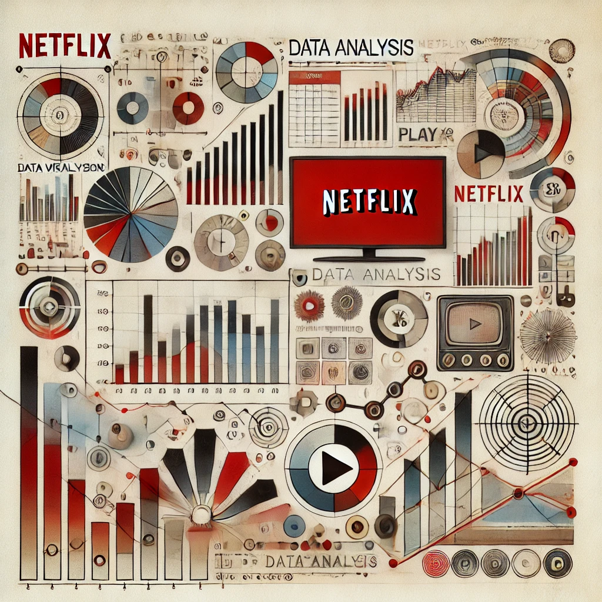

# Netflix TV Show and Movie Ratings Analysis using Python

This is an analysis of the Netflix shows based on the TV Show Ratings, with respect to different Years and the User Score Ratings. The dataset consists of TV Shows and Movies available on Netflix as of 2021. 
